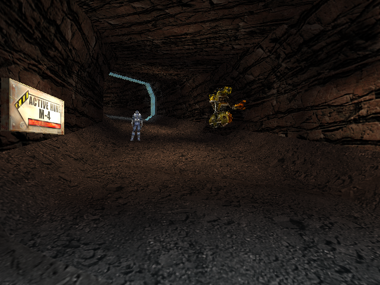
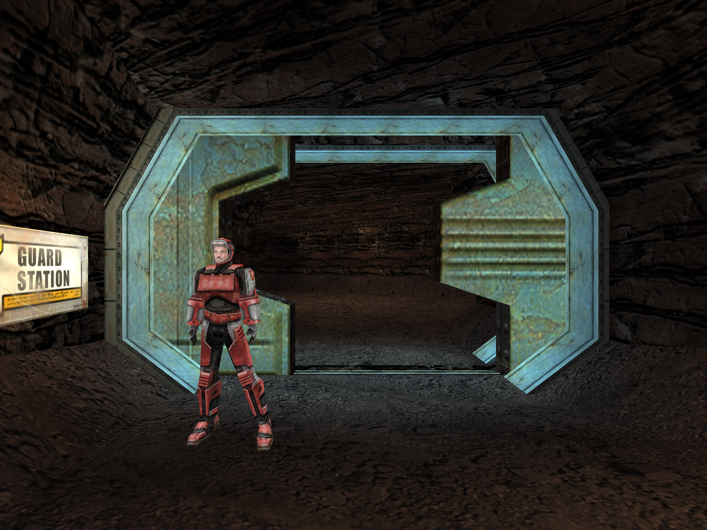

# Red Faction reconstruction for Original Xbox and PC

Work in progress: shared C/C++ reconstruction targeting a stock 64 MiB Xbox
through NXDK, with a maintained 32-bit PC build. Single-player comes first and
visual quality must meet the PS2 version. **There is no playable port yet.**



**PC capture, rendered at 640 x 480 from the recorded campaign diagnostic replay.**
A miner and mining robot in their authored Live Mines positions, using
reconstructed starting poses and shared model/texture resources. This capture
predates animation updates; startup-selected animation now advances in the shared
PC/Xbox runtime. NPC AI and final lighting remain unfinished. The image is a PC
diagnostic capture, not Xbox footage or finished campaign gameplay.



**PC capture, rendered at 1920 × 1440 using the shared reconstruction code.**
A staged Live Mines scene with the original miner model, textures and lightmaps,
and door panels placed halfway along their authored travel. This is a diagnostic
scene, not playable campaign footage. The Xbox target remains stock 64 MiB;
this higher-resolution image is not an Xbox capture.

Current outputs include archive/level diagnostics, a shared static geometry,
texture and lightmap preview for PC and Xbox, and reconstructed filename checksum,
entity eye-update and character tag-lookup routines. Model loading, gameplay and
full campaign reconstruction remain open. See [TO-DO.MD](TO-DO.MD),
[architecture](docs/ARCHITECTURE.md), and [provenance](docs/PROVENANCE.md).

The original installation is read from
`D:/Programming/GitHub/OpenRedFaction/Installed_Game`. Do not edit it or put
its binary/assets into tracked source. Local analysis and builds stay ignored.

The project root is `D:/Programming/GitHub/OpenRedFaction`. Shared C code is in
`src/core`, platform entry points in `src/platform/pc` and `src/platform/xbox`,
and public headers in `include/rf`. The earlier C-drive workspace now contains
relocation pointers. Its generated builds are preserved in `local/legacy-build-c`;
fresh builds use the new project's `build` directory.

## PC build and checks

From this repository in PowerShell, with Visual Studio 2022 C++ installed:

```powershell
cmake -S . -B build/pc -G 'Visual Studio 17 2022' -A Win32
cmake --build build/pc --config Release
ctest --test-dir build/pc -C Release --output-on-failure
python tools/inventory.py 'D:\Programming\GitHub\OpenRedFaction\Installed_Game'
python tools/verify_archives.py
python tools/inspect_levels.py
python tools/verify_levels.py
python tools/inspect_geometry.py
python tools/verify_geometry.py
python tools/test_geometry_corruption.py
python tools/verify_images.py
python tools/inspect_lightmaps.py
python tools/verify_lightmaps.py
python -m pip install --target local/python unicorn==2.1.4
python tools/verify_checksum.py 'D:\Programming\GitHub\OpenRedFaction\Installed_Game\RF.exe'
```

The Windows movement/look prototype can be launched with
`./build/pc/Release/rf_pc_play.exe Installed_Game`: WASD moves, arrows look,
Ctrl crouches and Escape exits. It uses the shared Xbox-oriented runtime at
640x480. This is a diagnostic scene; campaign play and performance tuning remain
unfinished. See [input controls and verification](docs/INPUT.md).

## Xbox diagnostic

Generate the current PC base-texture reference (Pillow is required by image checks):

```powershell
./build/pc/Release/rf_pc_preview.exe Installed_Game/levels1.vpp L1S1.rfl artifacts/live-mines-textured-pc.ppm Installed_Game/maps1.vpp Installed_Game/maps2.vpp Installed_Game/maps3.vpp Installed_Game/maps4.vpp Installed_Game/maps_en.vpp
```

Omit the map archive arguments for the older untextured reference. Textured output
now includes linear filtering and lightmaps. The shared-grid PC/Xbox comparison
passes for this frozen view; original-game and PS2 parity remain unverified.

Local prerequisites: NXDK at `C:/nxdk`, MSYS2 at `C:/msys64`, Clang64 compiler
and MinGW64 runtime DLLs for the SDK's existing host tools.

```powershell
python tools/build_apu_probe.py --backend-only
$env:MSYSTEM = 'CLANG64'
& 'C:\msys64\usr\bin\bash.exe' --noprofile --norc tools/build-xbox.sh
Copy-Item -LiteralPath 'D:\Programming\GitHub\OpenRedFaction\Installed_Game\tables.vpp' -Destination build/xbox/disc/tables.vpp
Copy-Item -LiteralPath 'D:\Programming\GitHub\OpenRedFaction\Installed_Game\levels1.vpp' -Destination build/xbox/disc/levels1.vpp
foreach ($name in @('maps1.vpp','maps2.vpp','maps3.vpp','maps4.vpp','maps_en.vpp','meshes.vpp','motions.vpp','audio.vpp')) {
    Copy-Item -LiteralPath (Join-Path 'Installed_Game' $name) -Destination (Join-Path 'build/xbox/disc' $name)
}
& 'C:\msys64\usr\bin\bash.exe' --noprofile --norc tools/build-xbox.sh
```

Outputs: `build/xbox/disc/default.xbe` and
`build/xbox/redfaction-diagnostic.iso`. The disc contains a private copy of the
original tables, first campaign-level archive, five map archives, meshes, motions and audio,
so keep that package local.
The diagnostic reports memory, reads Live Mines' section directory and spawn
transform, and loads its static geometry and base textures within explicit budgets.
It draws three base-textured and lightmapped geometry frames; gameplay remains open.
Before rendering, it runs 64 frames of the shared blended-skeleton animation
check, including eye transforms and generation-cache hits. It does not draw an
animated character yet.

## XEMU diagnostic validation

```powershell
cmake --build build/pc --config Release --target rf_animation_check
python tools/verify_animation_check.py
python tools/xemu_smoke.py
python tools/xemu_smoke.py --no-capture
python tools/xemu_smoke.py --reference artifacts/live-mines-textured-pc.ppm
```

The smoke harness compares Xbox animation checksums with the shared PC check;
`verify_animation_check.py` independently checks that same sequence against the
local original executable. Schema 8 requires the additional meshes/motions disc
archives above. All original assets and generated test packages stay local.
Use `--no-capture` for runtime-only checks when there is no new visible result;
it skips framebuffer acquisition entirely and cannot be combined with `--reference`.

The harness starts only its own emulator process with a hidden-window launch,
an isolated configuration, no input bindings, a copied EEPROM, `-snapshot`,
64 MiB RAM, muted audio, and localhost QMP telemetry. It shuts down its own process
and writes a report under `artifacts/xemu`. It never sends host input or captures
the desktop. The default `xemu` display backend is required by this installed
build for successful diagnostic boot; `--display none` loaded the image but faulted
inside the guest kernel before entry. Both installed 4627 debug and Complex
4627 v1.03 BIOSes passed earlier boot checks with the rendering backend. The latest
debug-BIOS run validates resident materials and their pixel checksum, then captures
the game's framebuffer from guest RAM. See docs/VALIDATION.md for the limited
lit PC/Xbox comparison; no campaign fidelity or frame rate claim is made.

## Headless Ghidra analysis

```powershell
./tools/analyze.ps1
```

This hashes `RF.exe`, creates/opens its matching project under `local/ghidra`,
and writes a function inventory and selected raw decompilations under
`artifacts/analysis`. Defaults use Ghidra 11.3.2 and Java 21 from the installed
local paths; script parameters override these paths. Community symbol addresses
are candidates until checked against the original executable.

## Campaign audio milestone

Xbox interactive campaign diagnostics now dispatch available controller sounds to
APU voices, which advance independently of rendering. The 180-frame door and
420-frame closing/reversal replays pass on stock 64 MiB XEMU with nonzero guest
DSP output and matching PC gameplay state. Use `--audio-capture` with
`tools/xemu_replay_check.py` to enable this check for bounded replays.
Xbox controller volume and pan now follow the gameplay listener; both replays
match PC spatial-setting telemetry. PC campaign mode now uses a bounded Windows output backend with the shared
mixer and spatial gain events. Sound groups/loop metadata and real-hardware
listening remain open. The shared PCM hash still checks a
separate unity-gain diagnostic stream, not the spatial device waveform.
See [audio evidence and dependency provenance](docs/controller-audio.md).

Run `./build/pc/Release/rf_pc_play.exe --campaign Installed_Game` for the PC
campaign diagnostic with device audio. Headless replays remain device-free.
The optional `rf_pc_audio_check.exe` validates device open/refill/stop/reopen
using a quiet synthetic sample; it is not part of device-independent CTest.
